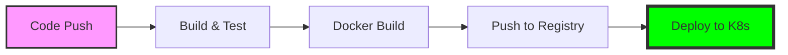

    │    │  │  └────────────────────────────────┘    │   │          │
    │  │  └─────────────────────────────────────────┘   │          │
    │  └─────────────────────────────────────────────────┘          │
    └───────────────────────────────────────────────────────────────┘

---

**Các thành phần cốt lõi (Core Objects):**

#### 1. 📦 Pod
- Đơn vị nhỏ nhất trong K8s.
- Chứa một hoặc nhiều containers (thường là 1).
- Chia sẻ Network (IP) và Storage (Volumes).
- **Ephemeral:** Có thể bị xóa và tạo mới bất cứ lúc nào.

#### 2. 🎮 Deployment
- Quản lý việc khai triển Pods.
- Đảm bảo số lượng bản sao (Replicas) luôn chạy.
- Hỗ trợ **Rolling Update** (cập nhật không gián đoạn) và **Rollback**.

#### 3. 🌐 Service
- Cung cấp địa chỉ IP ổn định (ClusterIP) và DNS name cho nhóm Pods.
- Load Balancing lưu lượng đến các Pods.
- Các loại: `ClusterIP`, `NodePort`, `LoadBalancer`.

#### 4. ⚙️ ConfigMap & Secret
- Tách rời cấu hình khỏi Image.
- **ConfigMap:** Lưu cấu hình thông thường (db url, profiles).
- **Secret:** Lưu dữ liệu nhạy cảm (passwords, tokens) - được mã hóa base64.

---

### SLIDE 11: Triển khai lên Kubernetes (K8s)

**Tiêu đề:**
## 🚀 Triển khai lên Kubernetes (K8s)

**Mô tả:** Chuyển đổi từ Docker Compose sang K8s Manifests

---

**Quy trình triển khai:**

1. **Build & Push Image:** Đẩy image lên Registry (Docker Hub/GHCR).
2. **Viết Manifests:** Định nghĩa Deployment, Service, ConfigMap bằng YAML.
3. **Apply:** Sử dụng `kubectl apply -f k8s/`.
4. **Expose:** Mở cổng để truy cập từ bên ngoài.

---

**Cấu trúc thư mục K8s:**

```bash
k8s/
├── backend-deployment.yaml  # Deployment & Service cho App
├── mysql-deployment.yaml    # Deployment, Service & PVC cho MySQL
├── redis-deployment.yaml    # Deployment & Service cho Redis
├── configmap.yaml           # Chung cho toàn bộ system
└── secrets.yaml             # Dữ liệu nhạy cảm
```

---

**Ví dụ: Backend Deployment & Service**

```yaml
apiVersion: apps/v1
kind: Deployment
metadata:
  name: backend-app
spec:
  replicas: 2
  selector:
    matchLabels:
      app: backend
  template:
    metadata:
      labels:
        app: backend
    spec:
      containers:
      - name: demo-app
        image: benwork17/demo-app:v1
        ports:
        - containerPort: 8080
        envFrom:
        - configMapRef:
            name: backend-config
        - secretRef:
            name: backend-secrets
---
apiVersion: v1
kind: Service
metadata:
  name: backend-service
spec:
  selector:
    app: backend
  ports:
  - protocol: TCP
    port: 80
    targetPort: 8080
  type: LoadBalancer
```

---

**Ưu điểm so với Docker Compose:**
- **Auto-healing:** Tự động restart container nếu lỗi.
- **Horizontal Scaling:** Dễ dàng tăng số lượng Pods (`kubectl scale`).
- **Service Discovery:** Tự động nhận diện các service mới.
- **Zero-downtime Deployment:** Cập nhật app mà không làm gián đoạn người dùng.

---

### SLIDE 12: [DEMO 3] K8s Orchestration với Minikube

**Tiêu đề:**
## 🛠️ [DEMO 3] K8s Orchestration với Minikube

**Mục đích:** Chạy hệ thống trên cụm K8s local

---

#### BƯỚC 1: Khởi động Minikube
```bash
minikube start --driver=docker
```

#### BƯỚC 2: Triển khai các thành phần
```bash
kubectl apply -f k8s/
```

**Output:**
```text
configmap/backend-config created
secret/backend-secrets created
deployment.apps/mysql-db created
service/mysql-service created
deployment.apps/redis-cache created
service/redis-service created
deployment.apps/backend-app created
service/backend-service created
```

#### BƯỚC 3: Kiểm tra trạng thái
```bash
# Xem các Pods đang chạy
kubectl get pods

# Xem các Services
kubectl get svc

# Xem logs của Backend
kubectl logs -f deployment/backend-app
```

#### BƯỚC 4: Truy cập ứng dụng
```bash
# Lấy URL để truy cập Service LoadBalancer trong Minikube
minikube service backend-service --url
```

---

### SLIDE 13: CI/CD Pipeline với GitHub Actions

**Tiêu đề:**
## 🚀 CI/CD Pipeline với GitHub Actions

**Mô tả:** Tự động hóa quá trình Build, Test và Deploy

---

**Workflow Overview:**



---

**GitHub Actions YAML (Rút gọn):**

```yaml
name: CI/CD Pipeline

on:
  push:
    branches: [ main ]

jobs:
  build:
    runs-on: ubuntu-latest
    steps:
      - uses: actions/checkout@v4
      
      - name: Set up JDK 21
        uses: actions/setup-java@v4
        with:
          java-version: '21'
          
      - name: Build with Maven
        run: ./mvnw package
        
      - name: Docker Login
        uses: docker/login-action@v3
        with:
          username: ${{ secrets.DOCKERHUB_USERNAME }}
          password: ${{ secrets.DOCKERHUB_TOKEN }}
          
      - name: Docker Build & Push
        uses: docker/build-push-action@v5
        with:
          push: true
          tags: user/demo-app:latest
```

---

### SLIDE 14: Tổng kết & Q&A

**Tiêu đề:**
## 🏁 Tổng kết & Q&A

---

**Key Takeaways:**
1. **Dockerize:** Đóng gói Spring Boot app giúp đồng nhất môi trường.
2. **Multi-stage:** Tối ưu kích thước image và bảo mật.
3. **Docker Compose:** Tuyệt vời cho Local Development & Orchestration đơn giản.
4. **Kubernetes:** Giải pháp cho Production, sẵn sàng mở rộng và tự động hóa cao.
5. **CI/CD:** Chìa khóa để release nhanh và an toàn.

---

**Tài liệu tham khảo:**
- Spring Boot Docker Guide: `spring.io/guides/topicals/spring-boot-docker`
- Docker Documentation: `docs.docker.com`
- Kubernetes Basics: `kubernetes.io/docs/tutorials`

---

# ❓ Questions?
### Cảm ơn mọi người đã theo dõi!
